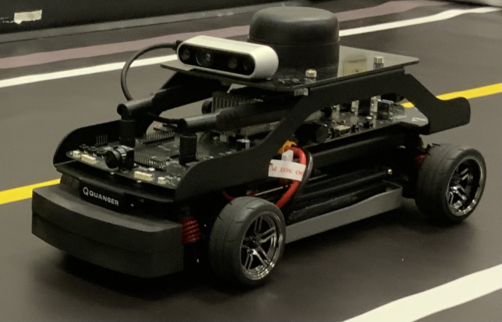

# Autonomous Driving with Reinforcement Learning 

This project implements the DDPG algorithm to a scaled car, aiming to train it for a constant-velocity tracking and a circular path tracking tasks.



## Algorithm Description

DDPG is the abbreviation of the Deep Deterministic Policy Gradient algorithm. It is a modification based on the deep Q-network (DQN) and the deterministic policy gradient (DPG) algorithms, such that it is able to use neural network function approximators to learn action functions and policies in continuous observation and action spaces. It also uses a replay buffer and a delayed update target network to deal with the unstable feature of the nonlinear function approximations via neural networks. Detailed explanations of DDPG is included in our report. We also refer readers to read the original papers of DDPG, DQN, and DPG to gain insights.

## File Description

### Buffer Data

Several tests were done with hand controlled episodes, and transition information was recorded in the replay buffer data. The buffer data was used to train several policy and critic networks located in the network_data folder.

The buffer files labeled "ref_path..." were used in the task of trying to follow the circle path in the room. 

Files labeled "ref_vel..." were used in the reference velocity task.

### Network Data

Trained network weights. All the existing network files are for the reference velocity task.

### Bag Data

All these files contain ROStopic information which contains information about vehicle states, actions, and critic and policy network outputs in real time.

### Buffer Node

This is a python-ROS script which was run on the physical vehicle using SSH to collect the replay buffer in real-time. Additionally, offline trained networks could be moved onto the vehicle computer and tested using this script as well as for gathering online training data. Due to the nature of the system, you will need a RC car which runs ROS-Python to run this script.

### Learning Node

This file was used to train policy and critic network using DDPG. It utilizes the chosen buffer data to run the script. Buffer rewards can be recalculated using this script as well.

### Learning Node Vel

This file is similar to the learning node file but more problem specific for the velocity task.

### Testing

This is a testing file to show some results without application to the RC car. Learning_node file can be ran and the critic and actor loss for every 10000 learning iterations will be shown.

## Dependencies

The algorithm was run in Python3. External dependencies are:

* `numpy` 
* `matplotlib` 
* `tensorflow`
* `pickle`

## Authors

Contributors are:

Perry Scott, Masters student, Mechanical Engineering Department, The University of Texas at Austin

Bryant Zhou, Masters student, Mechanical Engineering Department, The University of Texas at Austin

## Paper

This is the Deep Q-network (DQN) paper:
```
@article{mnih2015human,
  title={Human-level control through deep reinforcement learning},
  author={Mnih, Volodymyr and Kavukcuoglu, Koray and Silver, David and Rusu, Andrei A and Veness, Joel and Bellemare, Marc G and Graves, Alex and Riedmiller, Martin and Fidjeland, Andreas K and Ostrovski, Georg and others},
  journal={nature},
  volume={518},
  number={7540},
  pages={529--533},
  year={2015},
  publisher={Nature Publishing Group}
}
```

This is the Deterministic Policy Gradient (DPG) paper:
```
@inproceedings{silver2014deterministic,
  title={Deterministic policy gradient algorithms},
  author={Silver, David and Lever, Guy and Heess, Nicolas and Degris, Thomas and Wierstra, Daan and Riedmiller, Martin},
  booktitle={International conference on machine learning},
  pages={387--395},
  year={2014},
  organization={PMLR}
}
```

This is the Deep Deterministic Policy Gradient (DDPG) paper:
```
@article{lillicrap2015continuous,
  title={Continuous control with deep reinforcement learning},
  author={Lillicrap, Timothy P and Hunt, Jonathan J and Pritzel, Alexander and Heess, Nicolas and Erez, Tom and Tassa, Yuval and Silver, David and Wierstra, Daan},
  journal={arXiv preprint arXiv:1509.02971},
  year={2015}
}
```


